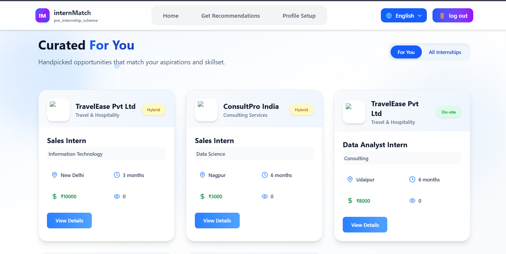

# Intern Match

###  AI-Powered Internship Suggestion Tool for the PM Internship Scheme

---

## Overview

The **Internship Recommendation System** helps students and first-time applicants find internship opportunities that best match their **skills, education, interests, and location preferences**.  

Developed for the **PM Internship Scheme**, the system focuses on accessibility, simplicity, and inclusivity — ensuring even candidates from rural and remote regions can easily identify suitable internships.

Instead of showing a long list, the system suggests **3–5 most relevant internships** presented in a clean, card-based interface.

---
## 🖼️ Project Preview  

  
  

*Clean and engaging UI designed for easy navigation and gamified input collection.*

## 🚀 Key Features

-  **AI-based personalized recommendations** using TF-IDF and cosine similarity  
-  **Gamified user input form** for collecting:
  - Skills  
  - Education level  
  - Sector/domain interests  
  - Location preferences  
-  **Top internship recommendations displayed as cards** (title, company, location, details)  
-  **Option to browse all available internships**   
-  **Intuitive UI** designed for users with low digital literacy

---

## 🧠 Approach

This project follows a **content-based filtering** approach:

1. **Data Preprocessing**  
   Internship descriptions and skills are vectorized using **TF-IDF (Term Frequency–Inverse Document Frequency)**.

2. **User Profile Encoding**  
   User inputs (skills, interests, education) are combined into a text profile.

3. **Similarity Calculation**  
   The system uses **cosine similarity** to measure how closely each internship matches the user’s profile.

4. **Recommendation Output**  
   The top **3–5 internships** with the highest similarity scores are recommended and displayed on the frontend.

---

## ⚙️ Tech Stack

| Layer | Technologies |
|-------|---------------|
| **Frontend** | React.js, Node.js, JavaScript |
| **Backend** | Python (Flask) |
| **Database** | MongoDB |
| **Libraries Used** | scikit-learn, pandas, numpy, Flask |
| **Model Techniques** | TF-IDF Vectorization, Cosine Similarity |

